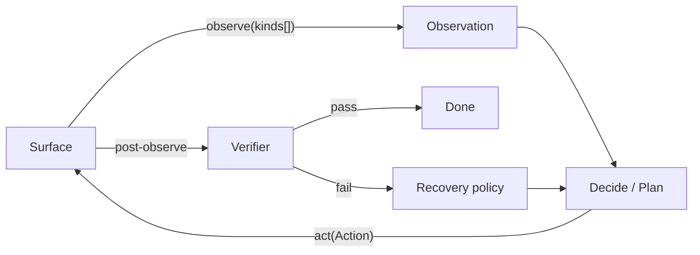

# Computer use — `cu-core` shared abstraction

> **Status: Planned** (see task task #93 (cu-core)).
>
> No `packages/cu-core` directory exists in the repo as of this wiki pass.
> The two existing computer-use codepaths still live independently:
> [`tools/epic_agent.py`](../../tools/epic_agent.py) (Windows + Citrix
> vision) and [`server/browser-bridge.ts`](../../server/browser-bridge.ts)
> + [`chrome-extension/`](../../chrome-extension/) (Playwright / DOM /
> extension queue). This page documents the **planned** shared abstraction
> they will both sit behind, so the surrounding pages can link to a
> single concept instead of repeating themselves.

## Intent (2-3 sentences)

`cu-core` introduces one vocabulary for "observe a thing, decide an
action, do it, verify it" across every surface Rachael drives: browser
tabs, desktop windows, Citrix sessions, CLI shells, and (later) phones.
Today each codepath invents its own primitives, so nothing — not a
verifier, not a recipe, not a benchmark — is reusable across them. The
abstraction is intentionally narrow at v1 (data types + interfaces +
in-process bus); adapters and routing arrive in follow-up tasks.

## Planned primitives

Five typed primitives, each documented with intent and non-goals in
`packages/cu-core/README.md` when written:

1. **`Surface`** — a thing you can observe and act on (browser tab,
   desktop window, Citrix session, CLI shell). Declares its
   `capabilities` (observation kinds + action kinds it supports) and a
   `cost` hint.
2. **`Observation`** — a typed snapshot of a surface in one of:
   `AxTree`, `DomSnapshot`, `UiaTree`, `SomScreenshot` (image + element
   list with marks), `RawScreenshot`, `TextDump`. Carries `timestamp`,
   `surfaceId`, `digest`.
3. **`Action`** — a typed verb: `Click({target})`, `Type({target,text})`,
   `Key({chord})`, `Hint({hint})`, `Scroll({target,dy})`,
   `Wait({ms|until})`, `Goto({url})`, `Shell({cmd})`, plus `Composite`
   for atomic multi-step. `target` is a `Locator` union:
   `Selector | UiaPath | HintKey | ElementMark | Coords` — never raw
   coords unless explicitly chosen.
4. **`Verifier`** — a pre/post check: `expectElement`, `expectText`,
   `expectUrl`, `expectImageRegion`, `expectNoChange`, `expectHash`.
   Runs against an `Observation`, returns `pass | fail | unknown` with
   evidence.
5. **`Recipe`** — a named, replayable sequence of
   `(verifier?, action, verifier?)` triples with parameters, success
   criteria, and provenance.

## Planned cheapest-reliable loop

The router (see [cu-router](./cu-router.md)) walks two priority orders
when picking how to observe and how to address an element. Cheaper /
more reliable comes first; failure cascades to the next tier:

```
Observation tier:  AxTree → UiaTree → DomSnapshot → SomScreenshot → RawScreenshot
Locator tier:      Selector → UiaPath → Hint → ElementMark → Coords
```

This priority is the single most important contract the abstraction
enforces. Every adapter declares which tiers it can serve, and the
router records "observation-tier miss" events back into the
[evolution engine](./evolution.md) as a mutation surface.

## Planned loop diagram



## Planned bus

A typed `ComputerUseBus` exists: surfaces register; the bus exposes
`observe(surfaceId, kinds[])`, `act(surfaceId, action)`,
`verify(surfaceId, verifier)`. Transport-agnostic — local in-process
today; the existing [control bus](./control-bus.md) queue + agent polling
becomes one transport implementation in the
[surface-adapters task](./desktop-tools.md). WSS transports for the
[LilyGo keyboard](./integrations-lilygo-keyboard.md) and
[iOS adapters](./integrations-ios.md) ride the same contract.

## Where the code will live (planned)

- `packages/cu-core/src/types.ts` — `Surface`, `Observation`, `Action`,
  `Locator`, `Verifier`, `Recipe`, plus their Zod schemas (used to
  codegen wire formats for non-TS adapters).
- `packages/cu-core/src/bus.ts` — `ComputerUseBus` + transport
  interface.
- `packages/cu-core/README.md` — the document we'd open-source first
  (see [oss extraction](./cu-router.md#related-tracks)).
- The rest of the app imports via `@rachael/cu-core` (tsconfig path
  alias; no publish step yet).

## Related pages

- [cu-router](./cu-router.md) — the router that walks the priority
  cascade
- [cu-skills](./cu-skills.md) — recipe / skill library built on top of
  the abstraction
- [cu-inspector](./cu-inspector.md) — analyst trajectory inspector
- [desktop-tools](./desktop-tools.md) — the Windows / Citrix surfaces
- [bridge](./bridge.md) — the browser surface
- [integrations-lilygo-keyboard](./integrations-lilygo-keyboard.md) /
  [integrations-ios](./integrations-ios.md) — new device surfaces
- [glossary](./glossary.md) — terms used across these pages
