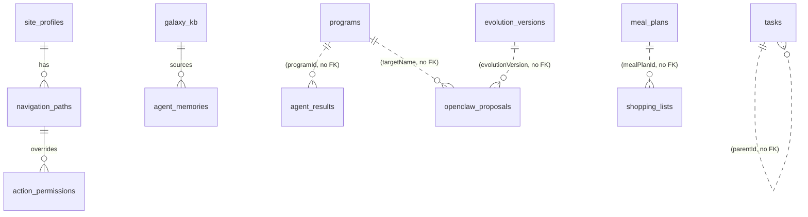

# Data model

All tables live in [`shared/schema.ts`](../../shared/schema.ts). They are
provisioned via `npm run db:push` (Drizzle Kit, **no migration files** are
maintained — see [audit § Deployment](./audit.md#deployment-and-ops)).

## Tables (in source order)

| Table | Purpose | Key columns |
|-------|---------|-------------|
| `programs` | Autonomous agent programs | name (uniq), type, schedule, cronExpression, code, codeLang, instructions, config (jsonb), enabled, costTier, computeTarget, tags, lastRun, nextRun |
| `skills` | Reusable toolkits | name (uniq), description, content, type, scriptPath |
| `agent_config` | Key-value settings (model overrides, soul prompt, budget, etc.) | key (uniq), value, category |
| `tasks` | TODO/DONE | title, status, body, scheduledDate (text), deadlineDate (text), priority, tags, parentId, imageUrl, repeat |
| `notes` | Freeform | title, body, tags, imageUrl |
| `captures` | Inbox items | content, type, source, processed, detectedType, urlTitle, urlDescription, urlImage, urlDomain, imageUrl, template |
| `agent_results` | Chronological agent outputs | programId, programName, summary, metric, model, tokensUsed, iteration, rawOutput, status |
| `reader_pages` | Saved web pages | url, title, extractedText, domain |
| `openclaw_proposals` | Pending self-modifications | section, targetName, reason, currentContent, proposedContent, status, source, warnings, proposalType, evolutionVersion, resolvedAt |
| `site_profiles` | Scraper site definitions | name (uniq), baseUrl, urlPatterns[], extractionSelectors (jsonb), actions (jsonb), defaultPermission, version, enabled |
| `navigation_paths` | Step sequences | name, siteProfileId (FK→site_profiles, cascade), steps[] (jsonb), extractionRules, permissionLevel |
| `recipes` | Saved CLI command chains | name (uniq), description, command, schedule, cronExpression, runCount, lastOutput |
| `audit_log` | Human + agent actions | actor, action, target, permissionLevel, result, details |
| `transcripts` | Meeting transcripts | title, platform, sourceUrl, durationSeconds, rawText, segments (jsonb), status, recordingType |
| `action_permissions` | Per-action permission overrides | navPathId (FK→navigation_paths, cascade), actionName, permissionLevel |
| `radar_seen_items` | Cross-run dedup for research-radar | contentHash, source, url, title |
| `radar_engagement` | User clicks on briefing items | url, source, title, programName |
| `meal_plans` | Weekly meal plans | weekStart, days[] (jsonb), preferencesSnapshot, status |
| `shopping_lists` | Generated shopping lists | mealPlanId, items[] (jsonb), cartStatus, store |
| `pantry_items` | Pantry inventory | name, category, quantity, unit, purchaseDate, estimatedExpiration, consumptionHistory (jsonb), avgDaysToConsume, status |
| `kiddo_food_log` | Kid-food acceptance log | itemName, verdict, similaritySource, notes, logDate |
| `nightly_recommendations` | Recipe + lunch suggestions | recDate, recipeRecommendation (jsonb), kiddoLunchSuggestion (jsonb), status |
| `agent_memories` | Long-term memory | programName, content, memoryType, tags[], relevanceScore, accessCount, lastAccessed, subject, validUntil, qdrantId, sourceKbId (FK→galaxy_kb) |
| `evolution_versions` | Evolution version history | version, changes (jsonb), gateResults (jsonb), metricsSnapshot (jsonb), appliedAt, rolledBackAt, status |
| `golden_suite` | Regression test cases | input, expectedOutput, source, programName |
| `evolution_observations` | Raw observations awaiting consolidation | programName, observationType, content, consolidated |
| `judge_cost_tracking` | Daily LLM judge cost | judgeType, model, tokensUsed, estimatedCost, date |
| `galaxy_kb` | Galaxy Knowledge Base entries | title, url (uniq), category, summary, fullText, tags[], verified, verifiedAt/By, flagged, flagReason, userNotes, memoryCount, agentAccessCount, searchTerm, updatedAt |
| `outlook_emails` | Persisted Outlook inbox | messageId (uniq), from, subject, date, body, preview, unread, isSnowNotification, syncedAt |
| `snow_tickets` | Persisted ServiceNow tickets | number (uniq), type, shortDescription, state, priority, assignedTo, assignmentGroup, updatedOn, source, slaBreached, url, detailCached, syncedAt |

## Relationships (mermaid)

`||--o{` = enforced FK. `||..o{` = logical relationship that is **not**
enforced at the DB level — see audit.

## Insert schemas / types

For every table above, `schema.ts` exports:

- `insertXxxSchema` — Zod schema with `.omit`-like field selection.
- `InsertXxx` — `z.infer<typeof insertXxxSchema>`.
- `Xxx` — `typeof xxxTable.$inferSelect`.

Routes import these from `@shared/schema` and validate `req.body` with
`safeParse` before passing to `storage`.

## Known schema issues

See [audit § Data integrity](./audit.md#data-integrity) for the full list.
Highlights:

- `tasks.parentId`, `agent_results.programId`, `openclaw_proposals.evolutionVersion`,
  `shopping_lists.mealPlanId` lack `.references()`.
- **No indexes** are declared via `index()` / `uniqueIndex()` anywhere. Many
  high-traffic lookup columns (`programName`, `contentHash`, `qdrantId`,
  `url`, `createdAt` ranges) would benefit.
- `tasks.scheduledDate` / `deadlineDate` are `text` (ISO string) instead of
  `date` / `timestamp`. Same for `nightly_recommendations.recDate` and
  `judge_cost_tracking.date`.
- Some `jsonb` columns use loose typing (`z.any()` in the Zod schema for
  `shopping_lists.items` and `meal_plans.days`).
