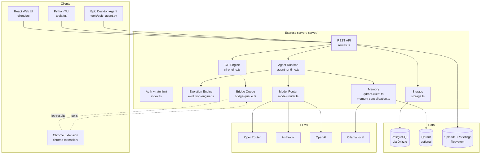

# Overview

**Rachael** is a personal autonomous-agent workspace. It is one application
running:

- A **React + Vite** front-end with a CRT-phosphor look (Doom-Emacs inspired).
- An **Express** back-end with **Drizzle ORM** over **PostgreSQL**.
- An **autonomous agent runtime** that schedules and runs ~30 user-defined
  programs (research radar, fed rates, github trending, estate-car-finder,
  etc.) on a tick loop.
- An **evolution engine** that observes the agent's behavior and proposes
  config changes through gated LLM judges.
- A **CLI engine** with Unix-style chain operators (`|`, `&&`, `||`, `;`)
  and 30+ built-in commands; both humans and the agent invoke it.
- A **Chrome extension** that acts as a "real browser bridge" — agents
  fetch through the user's authenticated Chrome to bypass cloud IP blocks
  and use real session cookies.
- A **Python desktop layer** that drives Epic Hyperspace via vision LLMs +
  pywinauto + UI automation, plus a notcurses-based TUI client for the
  DigitalOcean droplet.

The owner runs Rachael as a personal OS: agenda, capture inbox, briefings,
research, ServiceNow, Outlook, Teams, Citrix, Epic, voice control.

## Top-level architecture

## Key folders

| Folder                        | Role                                                       |
|-------------------------------|------------------------------------------------------------|
| `client/src/`                 | React app — `pages/Workspace.tsx` is the shell             |
| `client/src/components/views/`| One file per view (Agenda, Tree, Programs, …)              |
| `server/`                     | Express server — every concern is a `<topic>.ts` file      |
| `server/evolution-config/`    | Markdown config the evolution engine evolves               |
| `shared/`                     | `schema.ts` (Drizzle tables) + `capture-templates.ts`      |
| `chrome-extension/`           | MV3 extension that polls the bridge queue                  |
| `tools/`                      | Python desktop / OCR / TUI                                 |
| `tools/tui/`                  | notcurses-based terminal UI for the DO droplet             |
| `scripts/`                    | DO installer, schema push helpers                          |
| `script/build.ts`             | Production build (Vite + esbuild bundle of server)         |
| `tests/`                      | A single Vitest suite for bridge gating                    |
| `skills/`                     | Reusable TS toolkits (resilient-fetch, fuzzy-match, …)     |
| `.briefings/`                 | Generated overnight digest HTML files                      |
| `uploads/`                    | User-uploaded images for captures                          |

## Tech stack

- **Frontend**: React 19, Vite 7, Tailwind CSS 4, shadcn/ui, framer-motion,
  wouter (routing), TanStack Query, lucide-react.
- **Backend**: Node 20, Express 5, Drizzle ORM 0.39, `pg`, `multer`, `cors`,
  `ws`, `playwright` (fallback browser), `msedge-tts`, `nodemailer`, `multer`,
  `passport` (present but mostly unused).
- **Memory**: Qdrant (optional) + Ollama embeddings (`nomic-embed-text`),
  fallback to Postgres.
- **LLMs**: OpenRouter (default gateway) + direct Anthropic/OpenAI keys
  optional. Default model: `anthropic/claude-sonnet-4`. Cheap default tier
  is DeepSeek V3.
- **Test**: Vitest. One test file: `tests/bridge-gating.test.ts`.

## How the pieces fit (request-flow examples)

### A user types `M-x agenda` in the web UI

1. `Workspace.tsx` opens the `Minibuffer` in `command` mode.
2. Minibuffer maps `agenda` to `setViewMode("agenda")`.
3. `AgendaView` calls `useAgenda()` from `client/src/hooks/use-org-data.ts`.
4. Hook hits `GET /api/tasks/agenda` (`server/routes.ts:204`).
5. Routes call `storage.getOverdueTasks / getTasksByDate / getUpcomingTasks /
   getLatestResults` — Drizzle queries against Postgres.

### The agent runs `research-radar` on its tick

1. `agent-runtime.ts` `tickPrograms()` finds the next due program from DB.
2. Inline TS code is materialized, `bridgeFetch`/`smartFetch` helpers injected,
   then executed via `npx tsx` subprocess with env vars (`__BRIDGE_TOKEN`,
   `__BRIDGE_PORT`, `__apiKey`).
3. The program calls `bridgeFetch("https://reddit.com/best.json")` which queues
   a job in `bridge-queue.ts`.
4. The Chrome extension polls `/api/bridge/ext/jobs`, executes the request in
   the user's real browser, and POSTs back to `/api/bridge/ext/results`.
5. Program output is consolidated into memories (LLM judge), an
   `agent_results` row is written, and `RECIPE:` / `PROPOSE:` directives
   become `openclaw_proposals` rows.

### A voice command via Google Home

1. IFTTT POSTs `{text:"add inbox julia king"}` to `/api/voice-cmd` with the
   `OPENCLAW_API_KEY` Bearer header.
2. Routes map keywords to a CLI command (`capture text "julia king"`).
3. The CLI executes via `executeChain()` and the result is optionally pushed
   to ntfy.

## Where to read next

- For UI: [Frontend shell & views](./frontend.md)
- For routes: [REST API routes](./backend-routes.md)
- For data: [Data model](./data-model.md)
- For risks: [Best-practices audit](./audit.md)
